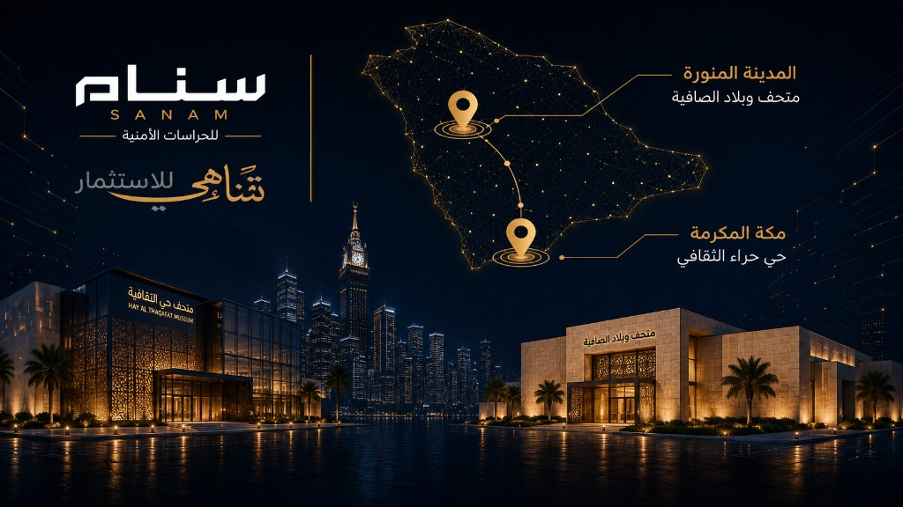

<!DOCTYPE html>
<html lang="ar" dir="rtl">
<head>
  <meta charset="UTF-8" />
  <meta name="viewport" content="width=device-width, initial-scale=1.0" />
  <title>التقنية والتحول الرقمي | سنام — تناهي للاستثمار</title>
  <link rel="preconnect" href="https://fonts.googleapis.com" />
  <link rel="preconnect" href="https://fonts.gstatic.com" crossorigin />
  <link href="https://fonts.googleapis.com/css2?family=IBM+Plex+Sans+Arabic:wght@300;400;500;600;700&family=Tajawal:wght@400;500;700;800&display=swap" rel="stylesheet" />
  <link href="https://cdn.jsdelivr.net/npm/bootstrap-icons@1.11.3/font/bootstrap-icons.min.css" rel="stylesheet">
  <link rel="stylesheet" href="https://unpkg.com/leaflet@1.9.4/dist/leaflet.css" />
  <link rel="stylesheet" href="assets/css/main.css" />
  <link rel="stylesheet" href="assets/css/digital-portal.css" />
  <link rel="stylesheet" href="assets/css/client-chat.css" />
  <link rel="stylesheet" href="assets/css/mobile-sim.css" />
  
</head>
<body class="digital-portal-body">
  <!-- ===== LOGIN ===== -->
  

    

      
      

    

    

      

        

          <h1>مرحباً بك في منصة سنام</h1>
          
منصة التشغيل الأمنية الرقمية

        

        <form id="login-form" class="login-form" autocomplete="on">
          <label>
            البريد الإلكتروني
            

              <i class="bi bi-envelope" aria-hidden="true"></i>
              <input type="email" id="login-email" placeholder="client@demo.com" required value="client@demo.com" />
            

          </label>
          <label>
            كلمة المرور
            

              <i class="bi bi-lock" aria-hidden="true"></i>
              <input type="password" id="login-password" placeholder="••••••••" required value="123456" />
              <button type="button" class="login-eye" id="login-toggle-pass" aria-label="إظهار كلمة المرور">
                <i class="bi bi-eye"></i>
              </button>
            

          </label>
          <button type="submit" class="btn btn-login-gold btn-block">دخول المنصة</button>
          
تجريبي: client@demo.com / 123456

        </form>
      

    

  

  <!-- ===== DIGITAL APP ===== -->
  

    <header class="digital-portal-top">
      

      

      

        
      

      

        

          
 مباشر

          

            —
            —
          

        

        

          
أ

          

            <strong id="user-name">أحمد السالم</strong>
            <small id="user-role">مدير المشروع · تناهي للاستثمار</small>
          

          <button type="button" class="dpt-user-menu" id="logout-btn" title="تسجيل الخروج">
            <i class="bi bi-box-arrow-left"></i>
          </button>
        

      

    </header>

    

      <main class="digital-portal-content" id="content"></main>
    

    <!-- زر المساعد الذكي — تبويب عمودي على اليسار -->
    <button type="button" class="ai-side-tab" id="ai-tab" aria-label="فتح المساعد الذكي" aria-expanded="false">
      
        <svg viewBox="0 0 48 48" width="28" height="28" fill="none">
          <path d="M24 6c-7.2 0-13 5.4-13 12.2 0 4.6 2.5 8.6 6.3 10.7V33c0 1.2.9 2.2 2.1 2.2h9.2c1.2 0 2.1-1 2.1-2.2v-4.1c3.8-2.1 6.3-6.1 6.3-10.7C37 11.4 31.2 6 24 6z" stroke="currentColor" stroke-width="2.2"/>
          <circle cx="18.5" cy="18" r="1.8" fill="currentColor"/>
          <circle cx="29.5" cy="18" r="1.8" fill="currentColor"/>
          <path d="M18.5 24c1.6 2.2 3.8 3.3 5.5 3.3s3.9-1.1 5.5-3.3" stroke="currentColor" stroke-width="2" stroke-linecap="round"/>
          <path d="M19 37.5h10M21 41h6" stroke="currentColor" stroke-width="2.2" stroke-linecap="round"/>
        </svg>
      
      
      المساعد الذكي
    </button>

    <aside class="ai-panel" id="ai-panel" aria-label="المساعد الذكي" aria-hidden="true">
      

        

          
            <svg viewBox="0 0 40 40" width="22" height="22" fill="none">
              <circle cx="14" cy="16" r="2.2" fill="currentColor"/>
              <circle cx="26" cy="16" r="2.2" fill="currentColor"/>
              <path d="M14 23c2 2.6 4.5 3.8 6 3.8s4-1.2 6-3.8" stroke="currentColor" stroke-width="2.2" stroke-linecap="round"/>
            </svg>
          
          <strong>سنام، مساعدك الشخصي</strong>
        

        <button type="button" class="ai-close" id="ai-close" aria-label="إغلاق">×</button>
      

      

        

          

            <svg viewBox="0 0 120 90" width="88" height="66" fill="none">
              <circle cx="60" cy="28" r="16" stroke="#fff" stroke-width="3"/>
              <path d="M44 52c6-8 26-8 32 0" stroke="#fff" stroke-width="3" stroke-linecap="round"/>
              <path d="M60 44v28M48 58h24" stroke="#fff" stroke-width="3" stroke-linecap="round"/>
              <path d="M84 36c8 2 14 10 12 18" stroke="#fff" stroke-width="3" stroke-linecap="round"/>
              <circle cx="98" cy="30" r="5" stroke="#fff" stroke-width="2.5"/>
            </svg>
          

          <h3>مرحباً، أنا مساعدك الشخصي!</h3>
          
يسرني أن أوفر لك معلومات عن تشغيل مواقع تناهي للاستثمار عبر منصة سنام

        

        

        

          يرجى عدم مشاركة المعلومات الشخصية مثل اسم المستخدم أو كلمة المرور أو رمز التحقق مع المجيب الآلي
        

      

      <form class="ai-compose" id="ai-form">
        <input type="text" id="ai-input" placeholder="اكتب رسالتك هنا" autocomplete="off" />
        <button type="submit" aria-label="إرسال"><i class="bi bi-send-fill"></i></button>
      </form>
    </aside>
  

  

  

  <footer class="site-footer">
    
© 2026 سنام الأمن للحراسات الأمنية | حقوق التطوير والتشغيل التقني : مواسم التقنيات المتخصصة | 7052613374

  </footer>

  
  
  
  
  
  
</body>
</html>
